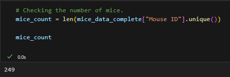
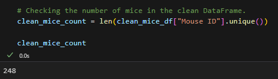
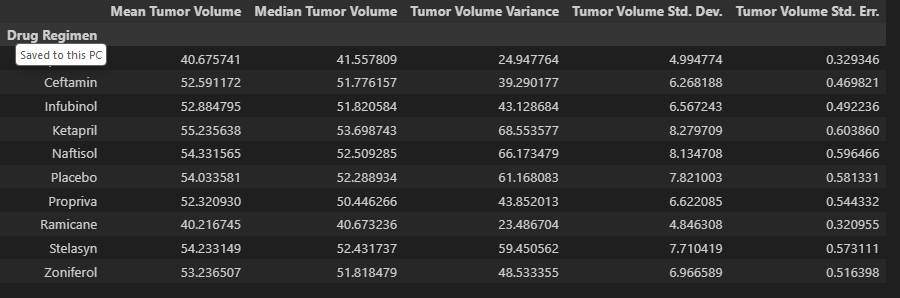
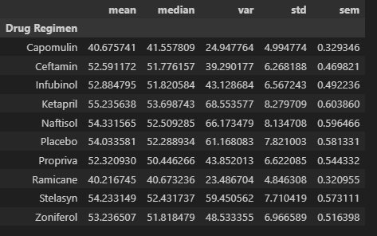

# Pymaceuticals Inc.

##### Link to Matplotlib-Challenge code - https://github.com/MichaelELeonard/Matplotlib-Challenge/blob/main/pymaceuticals_working.ipynb
 

The task of this challenge was to complete the data analysis on a drug regimen to treat Squamous Cell Carcinoma (SCC), which is a form of skin cancer.  Pymaceuticals Inc. has a drug of interest for this treatment called Capomulin and a study was conducted to see how Capomulin performed against other SCC drug options.  249 mice with SCC tumors received a drug regimens to examine their effects on their SCC tumor size.  The drugs being examined in the study included: 
* Capomulin
* Ceftamin
* Infubinol
* Ketapril
* Naftisol
* Placebo
* Propriva
* Ramicane
* Stelasyn
* Zoniferol   

## DATA ASSEMBLY AND CLEANING
The first task in the process was to prepare the data for analysis.  Two DataFrams ‘mouse_metadata’ and ‘study_results’ were merged into one all-encompassing DataFrame ‘mice_data_complete.’  Each unique mouse was counted totaling 249.  A duplicate mouse ID ‘g989’ was identified and its data was removed from the data pool and the information was stored in a new DataFrame “clean_mice_df” and the unique mouse count was again tabulated now totaling 248.    
   

   

 
 

## SUMMERY STATISTICS
Overall summary statistics were then calculated examining the mean, median, variance, standard deviation & standard error of measurement of all the drug regimens in the trial.

These results were then replicated utilizing the aggregation method.  
 

 
 

## BAR & PIE CHARTS
The “clean_mice_df” was utilized to provide information for the next set for charts.  A bar chart was created to examine Mouse ID/Timeplots for each drug regimen.  This chart was created using both Pandas and pyplot.     
 

A Pie Plot was also created showing the Female vs. Male mice count utilized in the study.  This chart was also created using Pandas and pyplot.
 

## QUARTILES, OUTLIERS & BOXPLOTS
The study data was then prepared to examine and the results of Capomulin Ramicane Infubinol
and Ceftamin in more detail.  The results from the clean_mice_df was isolated by drug type and the largest timepoint for each drug was identified to compare results.   This final tumor data was then merged with the existing drug DateFrame for further analysis.  This data was prepared for Boxplots by identifying the data quartiles for each drug dataset.  A Boxplot graph was created for the four drugs for examination.
 
 

 
 

## LINE AND SCATTER PLOTS
For the final analysis, the results of Capmulin was singularly examined.  A Line Plot was constructed to examine the SCC tumor size vs. the day point in the study and a Scatter Plot was used to show the relationship between SCC tumor size vs. the weight of the mice.
 
 

 
 

## CORRELATION AND REGRESSION
A Correlation and Regression line was added to the Scatter Plot to fully highlight the correlation and regression relationship between SCC tumor size vs. the weight of the mice.
 
 

 
 

## RESULTS
For this study, Pymaceuticals Inc. examined their drug of interest Capomulin vs. other drug regimens for the treatment of Squamous Cell Carcinoma (SCC) which is a form of skin cancer.  When looking at the Summary Statistics table, the tumor size of the test subjects that received Capomulin appears to be approximately 26% smaller than the eight other drug regimens in the study.  In the Bar Chart examining the Timepoints throughout the study by drug regimen, Capomulin appears to be outperforming the other drug regimens in the study.  Utilizing a Box Plot to examine tumor size vs drug regimens, Capomulin showed significantly improved results with the mean values in the high 30mm3.  When looking specifically at Capomulin, the Line Plot shows slow tumor growth in the first 20 days and then a significant reduction (8%) in overall tumor size from days 20 to 35.  Finally, the Scatter Plot with a Correlation and Regression overlay shows a strong positive correlation between tumor volume and subject weight.  In total, these initial trial studies highlight a potential positive upside for Capomulin in the treatment of Squamous Cell Carcinoma (SCC) and may warrant longer term studies on the efficacy of future Capomulin treatments.  

