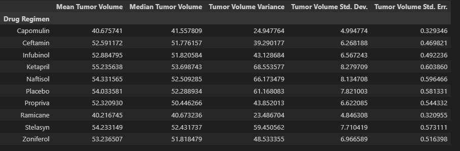

# Pymaceuticals Inc.

##### Link to Matplotlib-Challenge code - https://github.com/MichaelELeonard/Matplotlib-Challenge/blob/main/pymaceuticals_working.ipynb
 

The task of this challenge was to complete the data analysis on a drug regimen to treat Squamous Cell Carcinoma (SCC), which is a form of skin cancer.  Pymaceuticals Inc. has a drug of interest for this treatment called Capomulin, so initial a study was conducted to see how Capomulin performed against other SCC drug options.  249 mice with SCC tumors received drug regimens to examine effects on their SCC tumor size.  The drugs in the study included: 
* Capomulin
* Ceftamin
* Infubinol
* Ketapril
* Naftisol
* Placebo
* Propriva
* Ramicane
* Stelasyn
* Zoniferol   

## Data Assembly and Cleaning
The first step in the process was to prepare and clean the data for analysis.  Two dataframes ‘mouse_metadata’ and ‘study_results’ were merged into a single dataframe ‘mice_data_complete.’  Each mouse subject was counted totaling 249.  A duplicate mouse ID ‘g989’ was identified and its data was removed from the data pool, so after cleaning the data the unique mouse count totaled 248.    
   

   

 
 

## Summery Statistics
Overall summary statistics were calculated examining the mean, median, variance, standard deviation & standard error of measurement of all the drug regimens in the trial.

These results were also replicated utilizing the aggregation method.  
 

 
 

## Bar and Pie Charts
The cleaned dataframe was utilized to provide information for the next set of charts.  A bar chart was created to examine Mouse ID/Timeplots for each drug regimen.  This chart was created using both Pandas and pyplot.     
 

A pie chart was also created showing the Female vs. Male mice count utilized in the study.  This chart was also created using Pandas and pyplot.
 

## Quartiles, Outliers & Boxplots
The specific results of Capomulin, Ramicane, Infubinol, and Ceftamin were isolated for further exploration.  A boxplot graph was utilized to examine the four drugs.
 
 

 
 

## LINE and Scatter Plots
For the final analysis, Capmulin was specifically examined.  A line plot was constructed to examine the SCC tumor size vs. the day point in the study and a scatter plot was used to show the relationship between SCC tumor size vs. the weight of the mice.
 
 

 
 

## Correlation and Regression
A correlation and regression line was added to the scatter plot to fully highlight the relationship between SCC tumor size vs. the weight of the mice.
 
 

 
 

## Results
For this study, Pymaceuticals Inc. examined their drug of interest Capomulin vs. other drug regimens for the treatment of Squamous Cell Carcinoma (SCC) which is a form of skin cancer.  When looking at the summary statistics table, the tumor size of the Capomulin trial appears to be approximately 26% smaller than the eight other drug regimens in the study.  In the bar chart examining the timepoints throughout the study, Capomulin appears to be outperforming the other drug regimens in the study.  Utilizing a boxplot to examine tumor size vs drug regimens, Capomulin showed promising results with a mean value in the high 30mm3.  The line plot also shows that Capomulin slowed tumor growth with an 8% reduction in overall tumor size from days 20 to 35.  Finally, the scatter plot with the correlation and regression overlay shows a strong positive correlation between tumor volume and subject weight.  In total, these initial trial studies highlight a potential positive upside for Capomulin in the treatment of Squamous Cell Carcinoma (SCC) and may warrant longer term studies on the efficacy of Capomulin treatments.  

